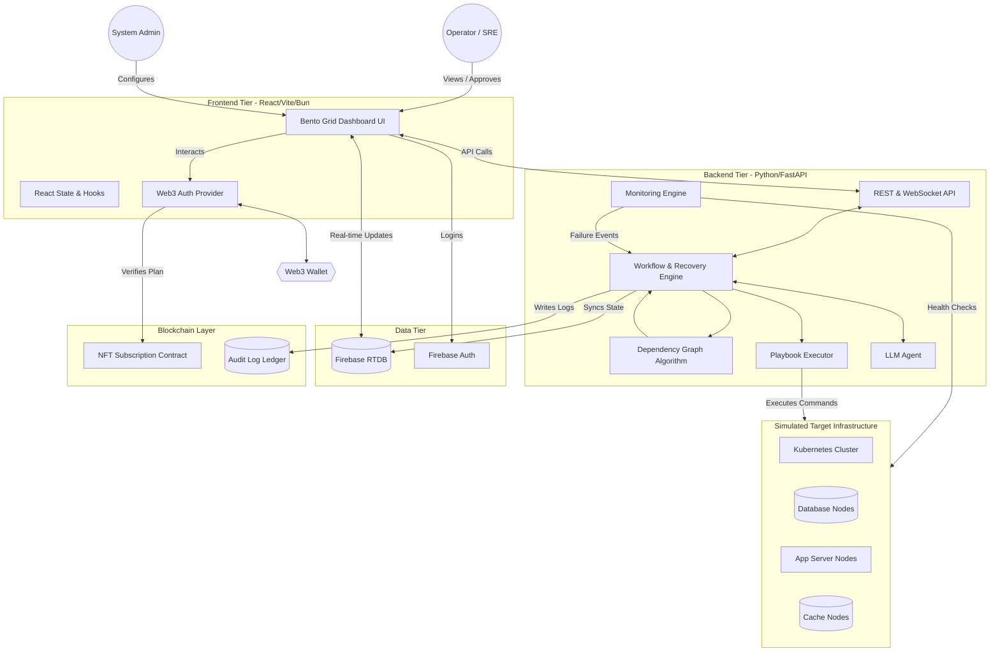
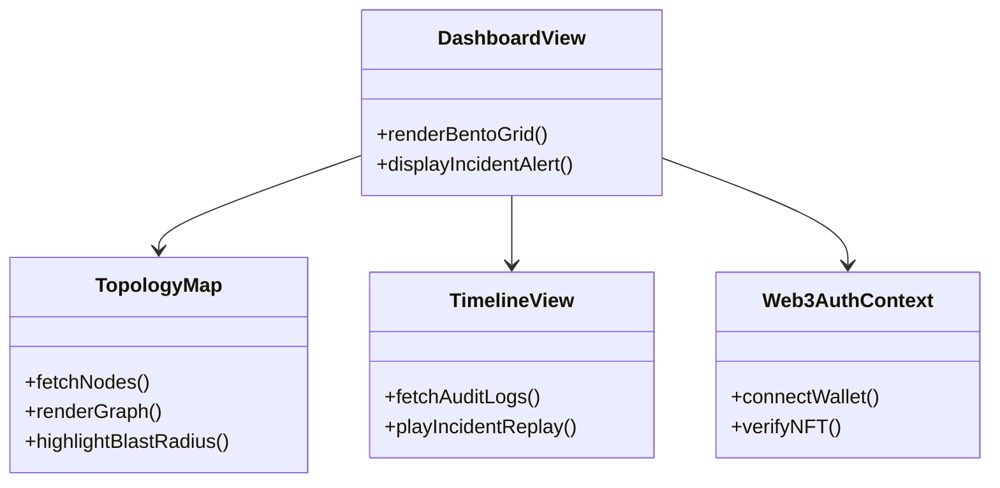
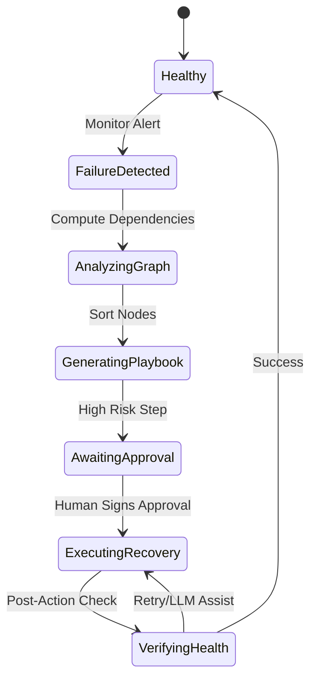

# Horizon System Architecture
**Platform:** Autonomous Enterprise Infrastructure Recovery Platform
**Version:** 1.0.0
**Date:** October 8, 2026

This document provides a comprehensive overview of the system architecture for Horizon, detailing the frontend, backend, data layer, infrastructure, web3 integration, and core execution engines.

---

## 1. System Overview

Horizon is designed as a distributed, scalable platform that orchestrates recovery operations across simulated and real-world microservice environments. 

The core design philosophy is event-driven. Monitoring systems detect anomalies, which are passed to the Workflow Engine. The engine uses a Dependency Graph to compute impact and delegates tasks to the Playbook Executor. A secondary LLM Agent assists in analyzing unseen errors and generating dynamic recovery steps.



---

## 2. Frontend Architecture

The Horizon frontend is a modern, high-performance web application optimized for speed and real-time data ingestion.

- **Core:** React, built and served using Vite and the Bun runtime.
- **Styling:** Tailwind CSS using a strict Light Theme (Cream, Black, Cobalt Blue) with neo-brutalistic design principles (sharp borders, strong shadows, high contrast).
- **Component Libraries:**
  - *Shadcn UI & Aceternity UI:* Used for core layout, bento grids, and complex interactive components (e.g., dependency graph visualization).
  - *Magic UI:* Used for subtle animations and glassmorphism accents.
  - *DaisyUI:* Used for rapid prototyping of standard elements like buttons and inputs.
- **State Management:** React Context API for global auth and web3 state, combined with custom hooks subscribing directly to Firebase Realtime Database for high-frequency updates (e.g., node status, recovery progress).
- **Routing:** React Router for client-side navigation between Dashboards, Incident Logs, Playbook Configuration, and Settings.



---

## 3. Backend Architecture

The backend is built in Python, leveraging FastAPI for asynchronous request handling. It acts as the orchestration brain of Horizon.

- **API Layer:** FastAPI providing RESTful endpoints for configuration and CRUD operations, and WebSockets for pushing real-time log streams to the frontend.
- **Monitoring Engine:** A dedicated daemon process that continuously polls the simulated infrastructure. It uses asynchronous HTTP requests, TCP port checks, and database pings to assess health.
- **Workflow Engine:** The core state machine. It receives failure events, transitions the incident state (Detected -> Analyzing -> Awaiting Approval -> Recovering -> Resolved).
- **LLM Integration:** Utilizes LangChain to interface with an external LLM (e.g., OpenAI). When a generic playbook fails, the LLM analyzes stack traces and logs to suggest a bespoke sequence of shell commands or API calls.

---

## 4. Data Architecture

Horizon relies on a hybrid data model: real-time synchronization via Firebase, and immutable logging via blockchain.

### 4.1 Firebase RTDB Schema Design

The Realtime Database is structured for fast client-side syncing without complex queries.

```json
{
  "users": {
    "uid123": {
      "email": "admin@horizon.com",
      "role": "incident_commander",
      "wallet_address": "0xABC..."
    }
  },
  "infrastructure": {
    "node_db_primary": {
      "type": "database",
      "status": "healthy",
      "depends_on": [],
      "last_ping": 1696780000
    },
    "node_api_gateway": {
      "type": "api",
      "status": "failed",
      "depends_on": ["node_db_primary", "node_redis_cache"],
      "last_ping": 1696780050
    }
  },
  "active_incidents": {
    "inc_998": {
      "trigger_node": "node_api_gateway",
      "status": "awaiting_approval",
      "blast_radius": ["node_web_frontend"],
      "proposed_playbook": ["restart_api", "flush_cache"]
    }
  }
}
```

### 4.2 Data Flow
- Frontend purely *listens* to `/infrastructure` and `/active_incidents`.
- Backend *writes* to these paths based on its background processes.
- Only configuration changes (e.g., adding a node) flow from Frontend to Backend via REST.

---

## 5. Infrastructure Layer

Horizon is designed to run in modern containerized environments. 

- **Orchestration:** Kubernetes (K8s) is the target execution environment.
- **Simulated Environment:** For testing and demonstration, Horizon deploys a target cluster consisting of:
  1. A Postgres Database deployment.
  2. A Redis Cache deployment.
  3. A Python/Flask API layer.
  4. A Node.js frontend layer.
- Horizon's Playbook Executor interacts with the Kubernetes API to orchestrate restarts, rollbacks, and configuration changes on these simulated targets.

---

## 6. Blockchain Layer

The Web3 integration provides verifiable access control and tiered service plans.

- **Smart Contracts:** Deployed on an EVM-compatible chain (e.g., Polygon).
- **NFT Subscription:** Access to Horizon is gated by ownership of a Horizon NFT. 
  - *Standard Tier NFT:* Basic automated recovery.
  - *Enterprise Tier NFT:* Unlocks LLM agent capabilities and full audit log exports.
- **Credential Security:** Hashes of critical recovery execution approvals are stored on-chain to provide an immutable audit trail that cannot be tampered with, even by a database administrator.

---

## 7. Recovery Engine

This is the most critical algorithmic component of Horizon.

1. **Dependency Graph Construction:** The engine builds a Directed Acyclic Graph (DAG) representing the infrastructure.
2. **Blast Radius Calculation:** When a node fails, the engine traverses downstream edges to find all affected services.
3. **Recovery Ordering:** The engine uses Topological Sorting to determine the absolute correct order to bring services back online. (e.g., You must start the DB before starting the API that queries it).
4. **Playbook Execution:** Based on the sorted order, the engine maps nodes to specific recovery scripts (Docker commands, K8s API calls, bash scripts) and executes them sequentially.



---

## 8. Monitoring & Detection

- **Health Checks:** Periodic active polling (pings, HTTP GET).
- **Failure Detection:** Anomalies are threshold-based (e.g., 3 missed pings = failure).
- **Alerting Pipeline:** Once a failure is verified, an event is pushed to a memory queue read by the Workflow Engine, which immediately updates Firebase to alert connected UI clients.

---

## 9. Security Architecture

- **Firebase Auth:** Handles traditional email/password and session management.
- **Blockchain Credentials:** High-risk actions require a cryptographic signature from an authorized wallet via BridgeKey Wallet on MST Blockchain Testnet.
- **RBAC:** Roles defined in Firebase (Viewer, Operator, Commander). Only Commanders can approve cross-region failovers.
- **Audit Logging:** Every state transition in the Workflow Engine is logged. Critical transitions are hashed and written to a smart contract.

---

## 10. API Design

Horizon uses a combination of REST and WebSockets.

**REST Endpoints (FastAPI):**
- `POST /api/v1/nodes` - Register a new infrastructure node.
- `GET /api/v1/graph` - Retrieve the current dependency topology.
- `POST /api/v1/playbooks/{id}/execute` - Manually trigger a runbook.

**WebSocket (FastAPI):**
- `ws://api.horizon.com/stream/logs` - Streams live output of playbook execution commands to the frontend terminal component.

---

## 11. Deployment Architecture

- **CI/CD:** GitHub Actions pipelines that build Docker images for the Horizon Backend and Frontend.
- **Environments:**
  - *Development:* Local docker-compose encompassing frontend, backend, Firebase emulator, and simulated target nodes.
  - *Production:* K8s cluster hosting Horizon services, connecting to production Firebase and Mainnet/Testnet RPCs.

---

## 12. Directory Structure

The project follows a monorepo structure to keep frontend, backend, and documentation unified.

```
D:\Workspace\Projects\horizon\
├── .github/                  # CI/CD workflows
├── Docs/                     # Documentation files
│   ├── PRD.md
│   └── ARCHITECTURE.md
├── frontend/                 # React/Vite/Bun application
│   ├── src/
│   │   ├── components/       # Shadcn, MagicUI, Aceternity components
│   │   ├── pages/            # View components (Dashboard, Timeline)
│   │   ├── hooks/            # Custom React hooks (Web3, Firebase)
│   │   └── utils/            # Helper functions
│   ├── package.json
│   └── tailwind.config.js
├── backend/                  # Python FastAPI application
│   ├── app/
│   │   ├── api/              # REST & WS routers
│   │   ├── core/             # Settings, security
│   │   ├── engine/           # Workflow, Graph Algorithm, Playbook Executor
│   │   └── models/           # Pydantic schemas
│   ├── requirements.txt
│   └── main.py
├── smart_contracts/          # Solidity files for NFTs and Audits
│   ├── contracts/
│   └── hardhat.config.js
├── simulated_infra/          # Docker compose for test targets
│   ├── docker-compose.yml
│   └── configs/
└── README.md
```

---
*End of Architecture Document*
