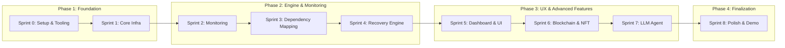

# Veltrix Platform - Project Roadmap

This document outlines the comprehensive 8-sprint plan (including Sprint 0) for the development of Veltrix, the Autonomous Enterprise Infrastructure Recovery Platform.

## 1. Project Timeline Overview

The Veltrix project is structured into 9 sequential 2-week sprints (Sprint 0 through Sprint 8).

---

## 2. Sprint 0: Foundation

**Focus:** Project setup, tooling, CI/CD, repo structure, dev environment.

### Goals
- Establish the baseline repository structure.
- Configure developer environments and tooling.
- Setup Continuous Integration and Continuous Deployment (CI/CD) pipelines.
- Initialize foundational documentation.

### User Stories
- As a Developer, I want a clean, well-documented repository so I can start coding immediately.
- As a DevOps Engineer, I want automated builds so that code integration is continuously tested.

### Tasks
- **S0-001**: Initialize Git Repository
- **S0-002**: Define Project Folder Structure
- **S0-003**: Setup Python Environment (Poetry/Pipenv)
- **S0-004**: Setup Node/Vite/Bun Frontend Environment
- **S0-005**: Configure ESLint and Prettier
- **S0-006**: Configure Python Linter (Ruff/Black)
- **S0-007**: Setup GitHub Actions CI Pipeline

### Acceptance Criteria
- Repository exists with `main` and `develop` branches.
- Local dev environments can be spun up with a single command.
- CI pipeline passes on pull requests.

### Dependencies
- None.

### Definition of Done
- Code reviewed and merged to `main`.
- CI green.
- Setup instructions documented in `README.md`.

---

## 3. Sprint 1: Core Infrastructure

**Focus:** Firebase setup, Docker environment, basic Python backend, React frontend skeleton.

### Goals
- Deploy foundational cloud resources.
- Create containerized environments for backend services.
- Establish the base React application with routing.
- Integrate Firebase Authentication.

### User Stories
- As a User, I want to securely log in to the Veltrix platform.
- As a Developer, I want the backend and frontend to communicate successfully.

### Tasks
- **S1-001**: Setup Firebase Project and Realtime DB
- **S1-002**: Integrate Firebase Auth in Frontend
- **S1-003**: Create Dockerfile for Python Backend
- **S1-004**: Create docker-compose.yml for local testing
- **S1-005**: Scaffold React + Vite Frontend
- **S1-006**: Setup Tailwind CSS, Shadcn UI, and DaisyUI
- **S1-007**: Create Basic FastAPI Backend Skeleton

### Acceptance Criteria
- User can register and log in via Firebase.
- Docker containers spin up without errors.
- Frontend loads standard UI components successfully.

### Dependencies
- Sprint 0 completion.

### Definition of Done
- Auth flow verified end-to-end.
- Container images built successfully.

---

## 4. Sprint 2: Monitoring & Detection

**Focus:** System monitoring agents, health check framework, failure detection engine.

### Goals
- Implement agents to monitor infrastructure health.
- Build the failure detection engine to trigger alerts.
- Store telemetry data securely.

### User Stories
- As a SysAdmin, I want Veltrix to detect when a server goes down automatically.
- As an SRE, I want configurable health check intervals.

### Tasks
- **S2-001**: Design Telemetry Data Model
- **S2-002**: Implement Python Monitoring Agent (Ping, HTTP, TCP)
- **S2-003**: Build Health Check Scheduling Engine
- **S2-004**: Implement Failure Detection Logic (Thresholds)
- **S2-005**: Integrate Webhooks for External Alerts
- **S2-006**: Create Mock Infrastructure Targets for Testing
- **S2-007**: Store Monitoring Results in Firebase Realtime DB

### Acceptance Criteria
- Agents can successfully ping and report status.
- Failures are logged when thresholds are breached.
- Data is written to Firebase in real-time.

### Dependencies
- Sprint 1 Backend and Database setup.

### Definition of Done
- Unit tests coverage > 80% for detection engine.
- System handles 100 concurrent mock targets.

---

## 5. Sprint 3: Dependency Mapping

**Focus:** Dependency graph engine, visualization, impact analysis.

### Goals
- Create a data structure to represent service dependencies.
- Build algorithms for blast radius / impact analysis.
- Provide a visualization component for the frontend.

### User Stories
- As an SRE, I want to see which downstream services are affected by a database failure.
- As a User, I want a visual graph of my infrastructure.

### Tasks
- **S3-001**: Design Dependency Graph Data Model
- **S3-002**: Implement Graph Traversal Engine (Impact Analysis)
- **S3-003**: Create API Endpoints for Graph Management
- **S3-004**: Integrate React Flow or similar graph library
- **S3-005**: Build UI for Adding/Editing Nodes and Edges
- **S3-006**: Implement Visual Highlight for Failing Nodes
- **S3-007**: Write Integration Tests for Graph Engine

### Acceptance Criteria
- Users can visually construct a dependency graph.
- Failing a parent node automatically flags child nodes as impacted.
- API returns correct graph structure.

### Dependencies
- Sprint 2 Monitoring data structure.

### Definition of Done
- Visual graph rendering accurately reflects backend data.
- Impact analysis tested with complex cyclical dependencies.

---

## 6. Sprint 4: Recovery Engine

**Focus:** Automated playbooks (failover, restart, restore), recovery ordering algorithm, approval gates.

### Goals
- Build the core autonomous recovery workflow engine.
- Implement standard playbooks.
- Add manual approval gates for high-risk actions.

### User Stories
- As a System, I want to automatically restart a crashed service.
- As an Admin, I want to approve a database failover before it happens.

### Tasks
- **S4-001**: Design Playbook Schema (YAML/JSON)
- **S4-002**: Implement Workflow Execution Engine
- **S4-003**: Create 'Service Restart' Playbook
- **S4-004**: Create 'Database Failover' Playbook
- **S4-005**: Implement Recovery Ordering based on Dependency Graph
- **S4-006**: Build Approval Gate Mechanism
- **S4-007**: Integrate Slack/Email Notifications for Approvals

### Acceptance Criteria
- Engine can parse and execute a standard playbook.
- Workflows pause when an approval gate is reached.
- Notifications are fired on critical failures.

### Dependencies
- Sprint 3 Dependency Mapping.

### Definition of Done
- Recovery workflows execute sequentially without race conditions.
- State machines tested and validated.

---

## 7. Sprint 5: Dashboard & UI

**Focus:** Bento grid dashboard, recovery timeline view, audit log UI, real-time updates.

### Goals
- Finalize the neo-brutalistic Veltrix theme (cream, black, cobalt blue).
- Build the main administrative dashboard.
- Implement detailed logging and timeline views.

### User Stories
- As a User, I want a comprehensive overview of my system's health on one screen.
- As an Auditor, I need a chronological log of all automated actions taken.

### Tasks
- **S5-001**: Implement Bento Grid Layout System
- **S5-002**: Build Global Health Overview Widgets
- **S5-003**: Create Recovery Timeline Component
- **S5-004**: Develop Paginated Audit Log Table
- **S5-005**: Style App with Veltrix Theme (Neo-brutalism)
- **S5-006**: Connect UI to Firebase Real-time Updates
- **S5-007**: Add Magic UI / Aceternity UI Flourishes

### Acceptance Criteria
- Dashboard matches the requested theme and color palette.
- Data refreshes live without page reloads.
- Timeline accurately reflects the sequence of automated recoveries.

### Dependencies
- Sprint 4 Core engines complete.

### Definition of Done
- UI passes accessibility and responsive design checks.
- Zero console errors during real-time data streaming.

---

## 8. Sprint 6: Blockchain & NFT

**Focus:** Web3 integration, NFT subscription plans, smart contracts, credential security.

### Goals
- Deploy smart contracts for SaaS subscription management via NFTs.
- Integrate Web3 wallet login.
- Enforce access control based on NFT ownership.

### User Stories
- As a Customer, I want to purchase an Enterprise Subscription NFT to access Veltrix.
- As a User, I want to authenticate using my MetaMask wallet.

### Tasks
- **S6-001**: Write Subscription NFT Smart Contract (ERC-721/1155)
- **S6-002**: Deploy Contract to Testnet (Sepolia/Mumbai)
- **S6-003**: Implement Web3 Wallet Provider Context in React
- **S6-004**: Build 'Connect Wallet' Authentication Flow
- **S6-005**: Implement Backend Middleware for NFT Verification
- **S6-006**: Build Subscription Tier UI
- **S6-007**: Audit Smart Contract Security

### Acceptance Criteria
- Users can mint a subscription NFT on the testnet.
- System grants/denies access based on token balance.
- Backend APIs reject unauthorized requests.

### Dependencies
- Sprint 1 Auth, Sprint 5 UI framework.

### Definition of Done
- Smart contract verified on Block Explorer.
- Web3 login flow is seamless and handles network switching.

---

## 9. Sprint 7: LLM Agent & Intelligence

**Focus:** LLM-powered decision making, natural language incident reports, intelligent recovery suggestions.

### Goals
- Integrate Large Language Models to assist in recovery.
- Generate human-readable incident post-mortems.
- Suggest new playbooks based on historical data.

### User Stories
- As an SRE, I want an AI to explain why a failure occurred.
- As an Admin, I want the system to suggest improvements to my recovery playbooks.

### Tasks
- **S7-001**: Integrate OpenAI / Local LLM API
- **S7-002**: Build Prompt Engineering Pipeline for Incident Context
- **S7-003**: Implement Natural Language Post-Mortem Generator
- **S7-004**: Create AI Chat Interface in Dashboard (Veltrix Assistant)
- **S7-005**: Develop Recovery Strategy Suggestion Engine
- **S7-006**: Ensure PII/Sensitive Data is Masked before LLM processing
- **S7-007**: Evaluate LLM Output Accuracy and Latency

### Acceptance Criteria
- Assistant provides relevant, context-aware answers to infrastructure queries.
- Post-mortems are generated automatically after a recovery event.
- Sensitive data does not leak to the LLM API.

### Dependencies
- Sprint 4 Recovery Engine (for context data).

### Definition of Done
- LLM integration is stable, robust, and handles rate limiting.
- Fallback mechanisms are in place if the LLM API is down.

---

## 10. Sprint 8: Polish & Demo

**Focus:** End-to-end testing, performance optimization, live demo preparation, documentation.

### Goals
- Harden the platform for production use.
- Optimize application performance.
- Finalize all documentation.
- Prepare a flawless live demo environment.

### User Stories
- As a Project Stakeholder, I want a smooth, bug-free demonstration of the platform.
- As a Future Developer, I want exhaustive documentation of the architecture.

### Tasks
- **S8-001**: Conduct End-to-End System Integration Testing
- **S8-002**: Perform Load Testing on Monitoring Engine
- **S8-003**: Optimize Frontend Bundle Size (Vite/Bun)
- **S8-004**: Finalize API Documentation (Swagger/OpenAPI)
- **S8-005**: Write User Manual and Operator Guide
- **S8-006**: Create Seed Data Script for Live Demo
- **S8-007**: Security and Penetration Testing Review

### Acceptance Criteria
- System handles simulated catastrophic failure gracefully.
- Frontend loads in under 2 seconds.
- All documentation is up-to-date and accurate.

### Dependencies
- All previous sprints.

### Definition of Done
- Project is ready for presentation.
- All P0 and P1 bugs are resolved.
- Version 1.0.0 tagged in Git.
