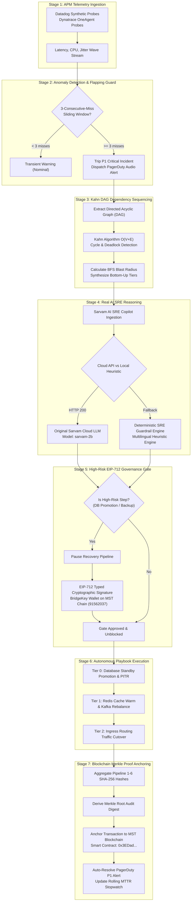

# Horizon — Autonomous Enterprise Infrastructure Recovery Platform

> **Detect infrastructure failures and autonomously restore distributed systems in the mathematically correct dependency order.**

<p align="center">
  
</p>

[](https://bun.sh/)
[](https://react.dev/)
[](https://www.typescriptlang.org/)
[](https://fastapi.tiangolo.com/)
[](https://testnet.mstscan.com)
[](https://www.sarvam.ai/)
[](https://modelcontextprotocol.io/)
[](https://opensource.org/licenses/MIT)

---

## 📌 Executive Summary & Problem Statement

When an enterprise's foundational databases, caches, queues, or microservices fail, recovery operations often devolve into manual chaos. Cross-functional engineering teams scramble in emergency War Rooms, manually restarting systems out of sequence.

### The Outage Dilemma
- **The Dependency Trap**: Restoring a web application or API gateway before its backing database is fully read-ready triggers thundering herds, connection pool starvation, and cascading crash loops.
- **Alert Flapping**: Transient network blips cause false-positive alert storms, paging on-call engineers unnecessarily and inducing alert fatigue.
- **Human Approval Bottleneck vs Unchecked Automation**: Autonomous recovery cannot be an unchecked runaway script; high-risk state mutations (such as promoting a database replica or point-in-time restores) require non-repudiable human authorization and tamper-proof audit trails.

### The Horizon Solution
**Horizon** is an Autonomous Enterprise Infrastructure Recovery Platform that observes distributed clusters in real time, isolates root-cause failures via anti-flapping sliding windows, sequences bottom-up recovery using **Kahn’s Topological Sorting algorithm $\mathcal{O}(V+E)$**, diagnoses incidents with **Sarvam AI**, enforces **EIP-712 cryptographic multi-signature gates** on the **MST Blockchain**, and anchors immutable **Merkle root audit proofs** on-chain.

---

## 📐 System Architecture & 7-Stage Autonomous Pipeline

Horizon organizes autonomous resilience into 7 discrete, verifiable pipelines. Every single stage generates a deterministic **SHA-256 cryptographic checksum** (`0x...`) logged to console and aggregated into a final on-chain Merkle root.



---

## 📂 Repository Structure & Source Code Organization

Horizon is structured as a monorepo adhering strictly to clean architectural boundaries:

```text
horizon/
├── apps/
│   ├── web/                          # Production React 18+ Frontend (Bun / Vite)
│   │   ├── src/
│   │   │   ├── components/           # Accessible Neo-Brutal UI Components
│   │   │   │   ├── common/           # Button, Card, Badge, Modal, Tooltip
│   │   │   │   ├── layout/           # Navbar (Platform Dropdown, War Room Links), Footer
│   │   │   │   ├── auth/             # OnboardingGate, Firebase Auth Provider
│   │   │   │   └── copilot/          # Sarvam AI Floating SRE Command Bar
│   │   │   ├── engine/               # Core Autonomous Recovery Engines
│   │   │   │   ├── dependencyGraph.ts # Kahn's Topological Sort O(V+E) & Blast Radius
│   │   │   │   ├── state.ts          # Unified Cluster State Manager & Recovery Jobs
│   │   │   │   ├── watchdog.ts       # Sliding Window Probe Watchdog & Rolling MTTR
│   │   │   │   ├── notificationHub.ts# War Room Dispatcher (#sre-bridge, Slack/Discord)
│   │   │   │   ├── sarvamAgent.ts    # Sarvam AI LLM Integration & Multilingual Guardrails
│   │   │   │   ├── mstBlockchain.ts  # Web3 Provider, EIP-712 Signatures, MST Testnet
│   │   │   │   ├── dagArchitectAgent.ts # Natural Language DAG Architecture Synthesis
│   │   │   │   └── dockerBridge.ts   # Docker Engine Socket Probe Client & Simulator
│   │   │   ├── lib/
│   │   │   │   ├── pipelineChecksum.ts# Deterministic SHA-256 & 7-Stage Checksum Generator
│   │   │   │   ├── utils.ts          # Tailwind cn() Class Merger
│   │   │   │   └── env.ts            # Validated Environment Variable Schema
│   │   │   ├── pages/                # Primary Application Views
│   │   │   │   ├── ObservabilityPage.tsx # Live Datadog/Dynatrace APM, PagerDuty, Checksums
│   │   │   │   ├── DashboardPage.tsx     # Executive Resilience Telemetry & MTTR
│   │   │   │   ├── TopologyPage.tsx      # Interactive 2D/3D Kahn DAG Visualizer
│   │   │   │   ├── RecoveryPage.tsx      # Live Autonomous Playbook Execution Console
│   │   │   │   ├── AuditPage.tsx         # Blockchain Merkle Audit Vault Explorer
│   │   │   │   ├── ArchitectPage.tsx     # AI Natural Language Mesh Architect
│   │   │   │   ├── DocsPage.tsx          # Full API, MCP Specifications & Tool Catalogue
│   │   │   │   ├── SubscriptionPage.tsx  # Web3 NFT Plan Gate (Enterprise/Pro/Free)
│   │   │   │   ├── PatentsPage.tsx       # Intellectual Property & Algorithmic Prior Art
│   │   │   │   └── PoliciesPage.tsx      # SLA, Governance & Security Compliance
│   │   │   └── App.tsx               # Top-level Routing & Navigation Provider
│   │   ├── package.json              # Bun dependencies
│   │   └── vite.config.ts            # Vite bundler configuration
│   │
│   └── api/                          # Python 3.11+ FastAPI Backend
│       ├── app/                      # Microservice router, background workers, probe polling
│       └── requirements.txt          # Python dependencies
│
├── mcpserver/                        # Model Context Protocol (MCP) Server for LLMs & IDEs
│   ├── app/
│   │   ├── engine/
│   │   │   ├── topology.py           # Python Kahn DAG Engine, Blast Radius, Sliding Probes
│   │   │   └── blockchain.py         # Web3 EIP-712 Verification & Merkle Digest
│   │   ├── tools/
│   │   │   └── registry.py           # 12 Enterprise MCP Tools Catalogue
│   │   ├── models.py                 # Pydantic Schemas for Tools & Incidents
│   │   └── main.py                   # SSE / HTTP Transport & Datadog Webhook Pipeline
│   ├── tests/                        # Pytest Test Suites (Extended Tools & Webhooks)
│   └── requirements.txt              # FastMCP, Pydantic, Web3, Pytest
│
├── packages/
│   └── shared/                       # Shared Contracts & Domain Specifications
│       └── src/
│           ├── schemas.ts            # Zod Validation Schemas (Topology, Incidents, Audits)
│           └── index.ts              # Universal Types & Constants
│
├── contracts/                        # Web3 Solidity Smart Contracts
│   ├── HorizonSubscription.sol       # ERC-721/ERC-1155 NFT Subscription Plan Gate
│   └── HorizonAuditVault.sol         # Immutable On-Chain Merkle Root Audit Store
│
├── infra/                            # Production & Simulated Infrastructure
│   ├── docker/                       # Dockerfile & Docker Compose cluster templates
│   ├── k8s/                          # Kubernetes Custom Resource Definitions (CRDs)
│   └── simulated/                    # In-memory chaos failure injection harness
│
├── Docs/                             # Comprehensive Technical & Strategic Documentation
│   ├── ARCHITECTURE.md               # Deep Architectural Whitepaper
│   ├── SystemAuditReport.md          # Formal Technical Systems Audit against Problem Statement
│   ├── Pitch.md                      # Executive Hackathon Pitch Deck & Script
│   ├── BusinessModelCanvas.md        # Commercialization Strategy & Enterprise Go-To-Market
│   ├── DEPLOYONMAINNET.MD            # MST Blockchain Mainnet Deployment Guide
│   └── USER_MANUAL.md                # Operator Handbook
│
├── README.md                         # Main Repository Guide (This Document)
└── package.json                      # Workspace Root Configuration
```

---

## 🛡️ The 7-Stage Cryptographic Pipeline & Checksum Manifest

To eliminate black-box ambiguity, every autonomous remediation cycle computes and logs a deterministic SHA-256 hash for each stage:

| Stage | Pipeline Name | Cryptographic Payload | Origin Source | Audit Purpose |
|:---:|:---|:---|:---|:---|
| **1/7** | **Telemetry Ingestion & APM Probe** | Target node ID, latency ($ms$), error rate, consecutive miss count | `telemetry-apm` | Verifies incoming probe telemetry integrity |
| **2/7** | **Anomaly Detection & P1 Tripwire** | Incident ID, severity, APM source, computed BFS blast radius | `telemetry-apm` | Proves threshold exceeded and alert triggered |
| **3/7** | **Kahn DAG Topological Sequencing** | Acyclic dependency tiers, directed edges, sequence order | `kahn-dag` | Validates acyclic recovery math $\mathcal{O}(V+E)$ |
| **4/7** | **Real AI SRE Root Cause Diagnosis** | Model identifier, prompt string, raw reasoning text, root cause | `sarvam-cloud-llm` / `sre-heuristic-guardrail` | Distinguishes original cloud AI vs local guardrail |
| **5/7** | **EIP-712 Cryptographic Approval Gate** | MST Chain ID (91562037), Contract, Signer wallet, ECDSA signature | `eip712-gate` | Guarantees non-repudiable human authorization |
| **6/7** | **Autonomous Playbook Execution** | Restored nodes list, completion timestamp, elapsed RTO seconds | `system` | Validates successful container & service recovery |
| **7/7** | **Merkle Audit Root Proof Anchoring** | Aggregated upstream hashes ($1 \to 6$) hashed into Merkle root | `system` | Anchors immutable verification digest on MST Chain |

### Real-Time Console Output
Whenever an incident is remediated, the structured logger outputs clean audit logs to the browser console:

```text
[PIPELINE 1/7: Telemetry Ingestion & APM Probe] Checksum: 0x3de50e8b3e... (telemetry-apm)
[PIPELINE 2/7: Anomaly Detection & P1 Tripwire] Checksum: 0x4b0de15256... (telemetry-apm)
[PIPELINE 3/7: Kahn DAG Topological Sequencing] Checksum: 0x2d08893e90... (kahn-dag)
[PIPELINE 4/7: Real AI SRE Root Cause Diagnosis] Checksum: 0xfc43ac1453... (sarvam-cloud-llm)
[PIPELINE 5/7: EIP-712 Cryptographic Approval Gate] Checksum: 0x99fb01532e... (eip712-gate)
[PIPELINE 6/7: Autonomous Playbook Execution] Checksum: 0xd486556db1... (system)
[PIPELINE 7/7: Merkle Audit Root Proof Anchoring] Checksum: 0x3992c93190... (system)
```

---

## 🤖 Real AI Engine & Provenance Verification

Horizon features an integrated **Sarvam AI SRE Copilot** that runs in two distinct, verifiable modes:

1. **Original Sarvam AI Cloud LLM (`sarvam-ai-cloud`)**:
   - Queries the Sarvam AI completions API (`https://api.sarvam.ai/v1/chat/completions`) using model `sarvam-2b`.
   - Ingests down-node topology, computes root-cause explanations, and outputs remediation directives.
   - Verified in the UI with a green `ORIGINAL SARVAM AI CLOUD (HTTP 200)` badge and exact latency in milliseconds.
2. **Local SRE Guardrail Engine (`sre-heuristic-guardrail`)**:
   - Engages when the cloud API key is offline or rate-limited.
   - Enforces strict deterministic SRE playbooks and multilingual natural language responses (English, Hindi, Hinglish, Spanish, French).
   - Prevents prompt injection and non-technical out-of-scope inquiries.

---

## ⚡ Model Context Protocol (MCP) Server

Horizon exposes an enterprise-grade MCP server for seamless integration with AI coding assistants (Claude Desktop, Cursor IDE, Google Antigravity CLI).

### 12-Tool MCP Catalogue
1. `horizon_get_topology`: Retrieves cluster microservices and directed dependency edges.
2. `horizon_probe_health`: Evaluates node health using the 3-consecutive-miss threshold.
3. `horizon_simulate_failure`: Injects simulated infrastructure outages on target nodes.
4. `horizon_trigger_recovery`: Initiates Kahn DAG recovery (supports `automatic`, `database_failover`, `service_restart`, and `restore_from_backup`).
5. `horizon_submit_gate_approval`: Submits cryptographic ECDSA signature to unblock paused recovery.
6. `horizon_get_incident_timeline`: Retrieves live RTO stopwatch, milestones, and rolling MTTR metrics.
7. `horizon_broadcast_incident`: Dispatches War Room alerts to Slack, Discord, and HTTP webhooks.
8. `horizon_sign_approval_gate`: Signs high-risk approval requests via EIP-712.
9. `horizon_verify_audit_proof`: Verifies Merkle audit roots against the MST Blockchain.
10. `horizon_synthesize_yaml`: Compiles cluster topology into valid Kubernetes / Docker Compose manifests.
11. `horizon_diagnose_cluster`: Runs natural language diagnostic analysis on cluster state.
12. `horizon_get_audit_logs`: Fetches immutable historical audit records.

### Inbound Alertmanager Webhook
Accepts Datadog and Prometheus Alertmanager alert webhooks at:
```http
POST /api/v1/incidents/webhook
Content-Type: application/json
```

---

## 🚀 Quick Start & Installation

### Prerequisites
- **[Bun](https://bun.sh/)** v1.2+ (Strictly required; do not use npm, yarn, or pnpm)
- **[Python](https://www.python.org/)** 3.11+
- **[Git](https://git-scm.com/)**

### 1. Clone & Install Frontend
```bash
# Clone the repository
git clone https://github.com/Precise-Goals/horizon.git
cd horizon

# Install root & frontend dependencies with Bun
bun install
```

### 2. Configure Environment Variables
Copy `.env.example` in `apps/web/`:
```bash
cp apps/web/.env.example apps/web/.env
```
Ensure the following keys are populated:
```env
VITE_SARVAM_API_KEY=your_sarvam_api_key_here
VITE_SARVAM_BASE_URL=https://api.sarvam.ai
VITE_SARVAM_MODEL=sarvam-2b
VITE_MST_RPC_URL=https://testnet.mstscan.com/rpc
VITE_MST_CHAIN_ID=91562037
```

### 3. Start Development Server
```bash
# Start frontend dev server on http://localhost:5173
bun run dev
```

### 4. Run the Full Test Suite
```bash
# Run all frontend & shared unit tests (88+ passing tests)
bun test

# Verify production TypeScript build with zero warnings
bun run --cwd apps/web build
```

### 5. Setup & Run MCP Server (Optional)
```bash
cd mcpserver
python -m venv .venv
source .venv/bin/activate  # On Windows: .venv\Scripts\activate
pip install -r requirements.txt
python -m pytest tests -v
python -m app.main
```

---

## 🎬 60-Second Hackathon Demo Guide

1. **Open the Observability Hub**:
   - Navigate to `http://localhost:5173/observability` (or click **Platform $\to$ Live Observability** in the navbar).
2. **Explain the Anti-Flapping Guard**:
   - Point to the **3-Miss Sliding Window** gauge. Highlight that single transient dropped packets do not flap alerts; exactly 3 consecutive drops are required.
3. **Simulate a Primary Outage**:
   - Select **PostgreSQL Primary (`db-primary`)** and click **"Simulate Breach"**.
   - Notice the Datadog APM latency wave spike to 999ms, CPU surge to 96%, and the PagerDuty P1 banner flash with synthesized audio chime.
4. **Click "Auto-Remediate with Real AI"**:
   - Watch the AI SRE Sentinel calculate the Kahn topological tiers, query Sarvam AI, simulate the EIP-712 governance signature on MST Testnet, restore services bottom-up, and log all **7 pipeline checksums**.
5. **Inspect the Checksums Matrix**:
   - Point to the **7-Pipeline Checksums Table** and click **"Copy Checksum Manifest"** to demonstrate cryptographic provenance to the judges.

---

## 📄 License & Compliance

Licensed under the [MIT License](./LICENSE). Developed for enterprise resilience, high-reliability autonomous operations, and hackathon presentation.
